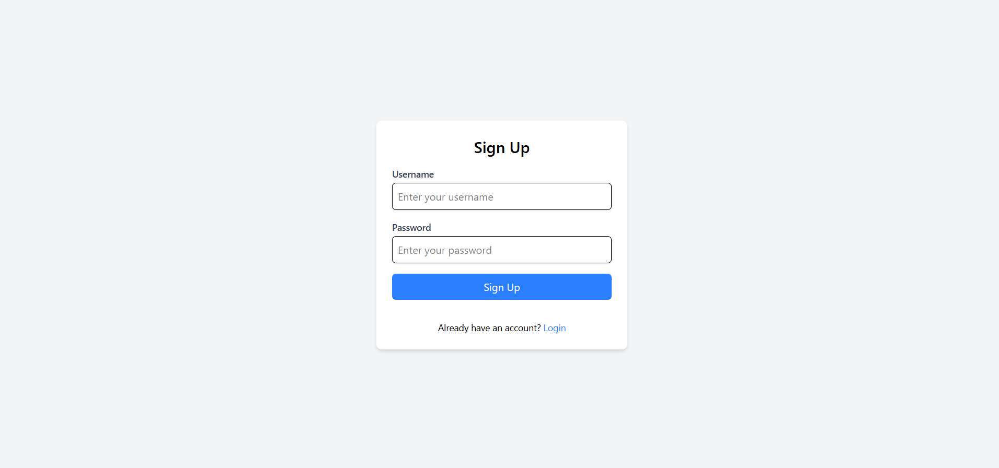
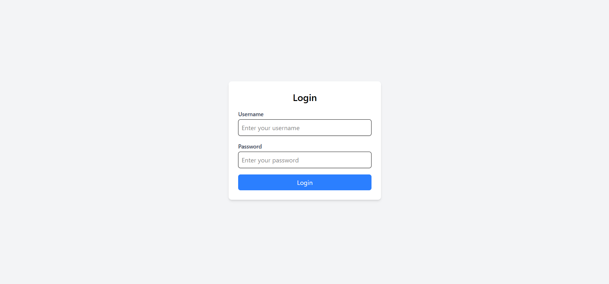
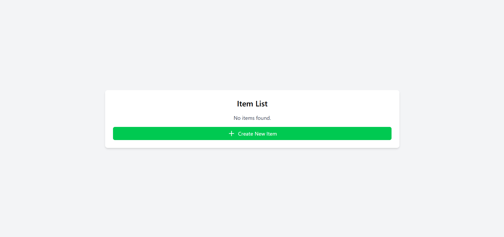
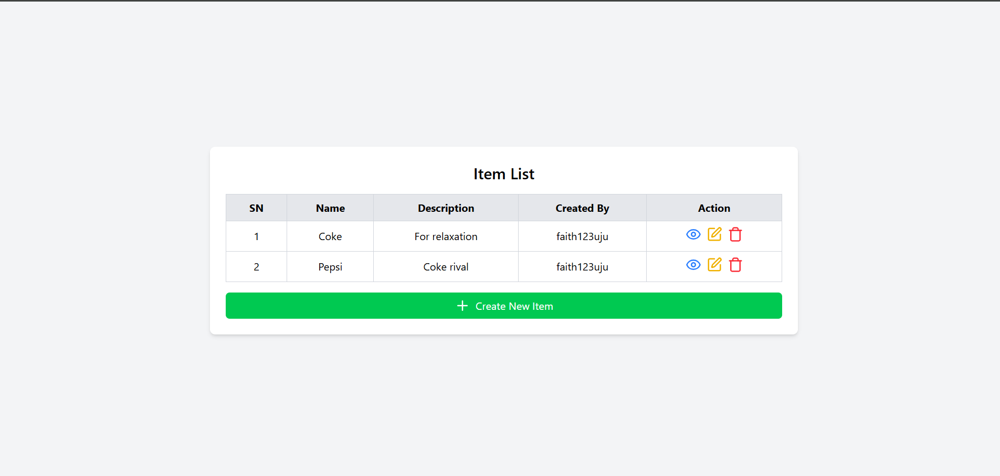
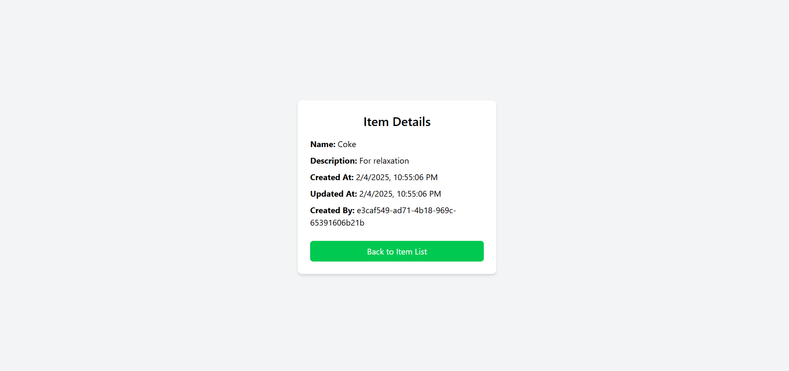
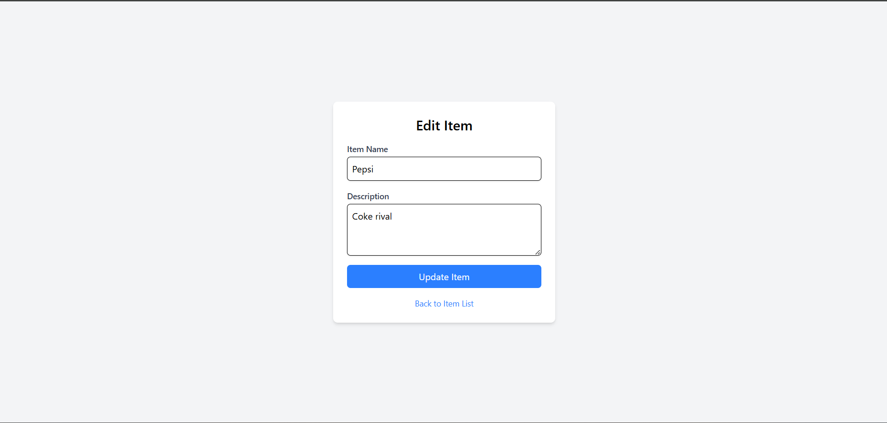

# MBL HighTech QA Assignment Solution

Before running any tests, ensure you have the following installed:

- **Node.js** (version v20.18.2 or higher)
- **npm** (version 10.9.0 or higher) or **Yarn**
- **Chrome** (for running Cypress tests and manually testing the ui)

## **Overview**

This repository includes both Backend API tests and Frontend UI tests, structured as follows:

- **`backend-test-with-cypress/`**: Contains API tests, including unit, integration, and end-to-end tests.
- **`frontend-test-with-jest/`**: Contains the frontend UI tests for the React application.

## **Project Setup**

### **Cloning the Repository**

To get started, clone this repository:

```bash
  git clone <https://github.com/FaithOzoanieke/mbl-qa-mini-project.git>
  cd <frontend-test-with-jest>
```

### **Setting Up the Backend API Tests**

#### **1. Navigate to the `backend-test-with-cypress` folder**

```bash
  cd backend-test-with-cypress
```

#### **2. Install Dependencies**

Using npm:

```bash
  npm install
```

Or using Yarn:

```bash
  yarn add
```

#### **3. Running Cypress End-to-End (E2E) Tests**

To execute E2E tests, use the following command:

```bash
  npx cypress open
```

This will open the Cypress test runner. Choose **Chrome (V8)**, select a test file, and click **Run**.

---

### **4. Setting Up the Frontend UI Tests**

#### **a. Navigate to the `frontend-test-with-jest` folder**

```bash
  cd frontend-test-with-jest
```

#### **2. Install Dependencies**

Using npm:

```bash
  npm install
```

Or using Yarn:

```bash
  yarn add
```

#### **3. Running Jest Tests**

To run unit and UI tests:

```bash
  npm run test
```

---

## **Tech Stack**

### **Backend Tests:**

- **Postman**: For manual API testing
- **Cypress**: For End-to-End (E2E) API tests
- **Axios**: For API calls

### **Frontend Tests:**

- **Jest**: For unit and UI tests
- **React Router**: For routing
- **TailwindCSS**: For styling

---

## **Test Cases Summary**

### **Backend API Test Cases**

| TC ID | Test Case Name | Method | Expected Result       | Actual Result         | Status |
| ----- | -------------- | ------ | --------------------- | --------------------- | ------ |
| TC001 | User Signup    | POST   | 201 Created           | 201 Created           | ✅ Pass |
| TC002 | User Login     | POST   | 200 OK & Token        | 200 OK & Token        | ✅ Pass |
| TC003 | Create Item    | POST   | 201 Created           | 201 Created           | ✅ Pass |
| TC004 | Update Item    | PATCH  | 200 OK & Updated Data | 200 OK & Updated Data | ✅ Pass |
| TC005 | Delete Item    | DELETE | 200 OK                | 200 OK                | ✅ Pass |
| TC006 | View One Item  | GET    | 200 OK                | 200 OK                | ✅ Pass |
| TC007 | View all Items | GET    | 200 OK                | 200 OK                | ✅ Pass |


### **Frontend UI Test Cases**

| TC ID | Test Case Name       | Expected Result                 | Actual Result       | Status |
| ----- | -------------------- | ------------------------------- | ------------------- | ------ |
| TC008 | User Registration UI | User is registered successfully | User registered     | ✅ Pass |
| TC009 | User Login UI        | User logs in and sees dashboard | Dashboard visible   | ✅ Pass |
| TC010 | Item Creation UI     | Item appears in the list        | Item visible        | ✅ Pass |
| TC011 | Item Update UI       | Item details updated            | Item updated        | ✅ Pass |
| TC012 | Item Deletion UI     | Item is removed                 | Item deleted        | ✅ Pass |
| TC013 | View one Item        | An Item is viewed from the List | Item Viewed         | ✅ Pass |
| TC014 | View all Items       | All items are seen listed       | All Items are Viewed| ✅ Pass |

---

## **Test Report**

### **QA Mini Project Test Report**

**Tester:** Faith Ujunwa Ozoanieke
**Date:** 2/4/2025
**Project Name:** QA Mini Project
**Test Environment:**

- API Base URL: `https://qa-test-9di7.onrender.com`
- Tools Used: Postman, Cypress, Jest

---

### **Test Execution Summary**

#### **Backend API Test Execution Details**


**TC001: User Signup Test**

- **Description:** Verify user can successfully sign up.
- **Steps:**
  1. Send `POST` request to `/signup` with valid details.
  2. Check if status code is `201 Created`.
  3. Verify user ID is returned in the response.
- **Expected Result:** User should be created successfully.
- **Actual Result:** ✅ User created successfully.

**TC002: User Login Test**

- **Description:** Vefify user can successfully log in.
- **Steps:**
  1. Send `POST` request to `/login` with valid details.
  2. Check if status code is `201 Created`.
  3. Verify token is returned in the response.
- **Expected Result:** User should receive authentication token.
- **Actual Result:** ✅ Token received successfully.

**TC003: User Login Test with Wrong Credentials**

- **Description:** Vefify user can successfully log in.
- **Steps:**
  1. Send `POST` request to `/login` with valid details.
  2. Check if status code is `201 Created`.
  3. Verify token is returned in the response.
- **Expected Result:** User should receive authentication token.
- **Actual Result:** ✅ Token received successfully.


**TC004: Update Item Test**

- **Description:** Verify user can update an existing item.
- **Steps:**
  1. Send `PATCH` request to `/items/:id` with updated details.
  2. Check if status code is `200 OK`.
  3. Verify response contains updated item details.
- **Expected Result:** Item should be updated successfully.
- **Actual Result:** ✅ Item updated successfully.


**TC005: Delete Item Test**

- **Description:** Verify user can delete an existing item.
- **Steps:**
  1. Send `DELETE` request to `/items/:id`.
  2. Check if status code is `200 OK`.
  3. Verify item is removed from the database.
- **Expected Result:** Item should be deleted successfully.
- **Actual Result:** ✅ Item deleted successfully.


**TC006: View One Item Test**

- **Description:** Verify user can retrieve details of a single item.
- **Steps:**
  1. Send `GET` request to `/items/:id`.
  2. Check if status code is `200 OK`.
  3. Verify item is removed from the database.
- **Expected Result:** Item should be deleted successfully.
- **Actual Result:** ✅ Item deleted successfully.


**TC007: View One Item Test**

- **Description:** Verify the response contains a list of items.
- **Steps:**
  1. Send `GET` request to `/items`.
  2. Check if status code is `200 OK`.
  3. Verify item is removed from the database.
- **Expected Result:** All items should be retrieved successfully.
- **Actual Result:** ✅ Items retrieved successfully.


**PROBLEM**
**Code does not use a state management library (like Redux or Zustand). However, it stores authentication state using localStoragew which is not considered safe.**

📌 *Need help? Feel free to reach out!* 🚀

Screenshots of the app UI






